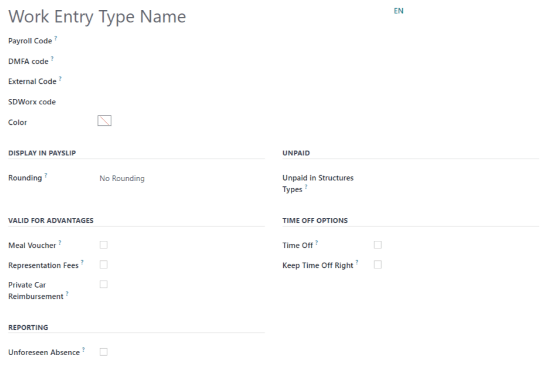
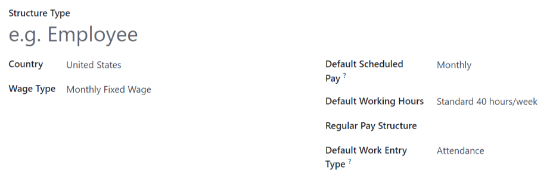
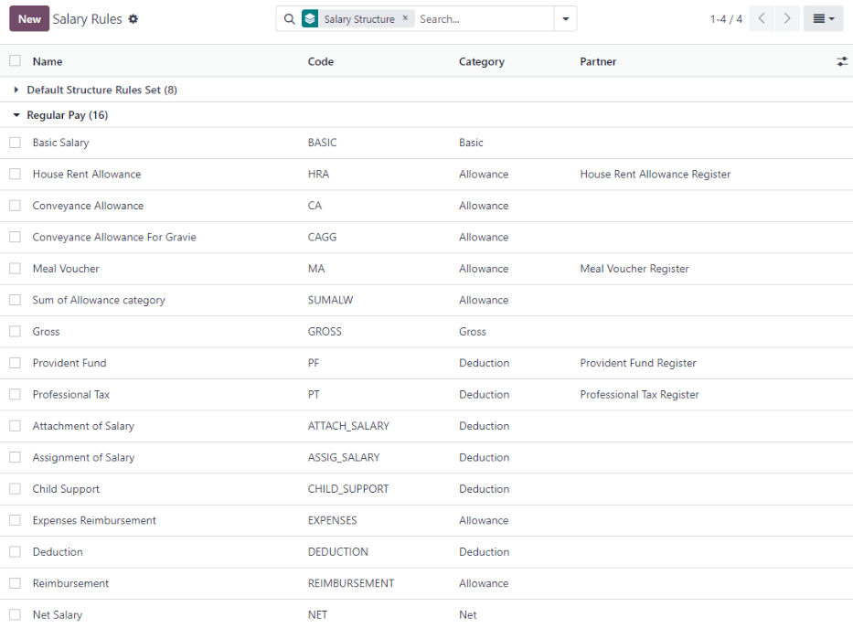
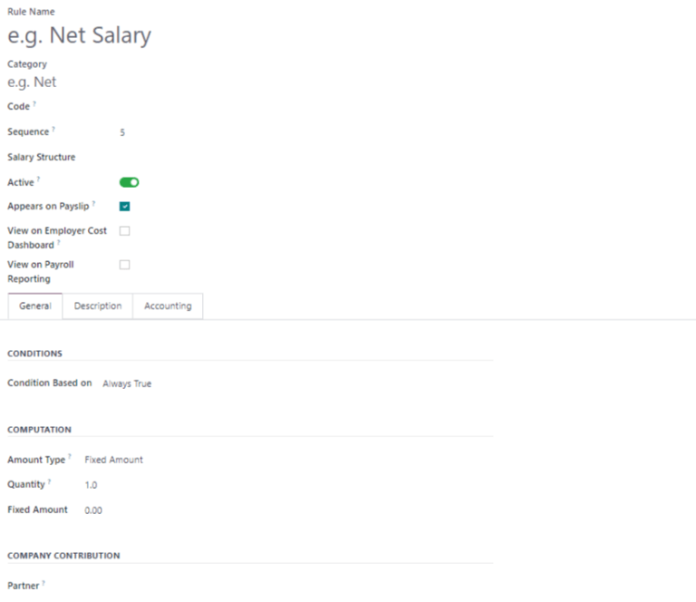
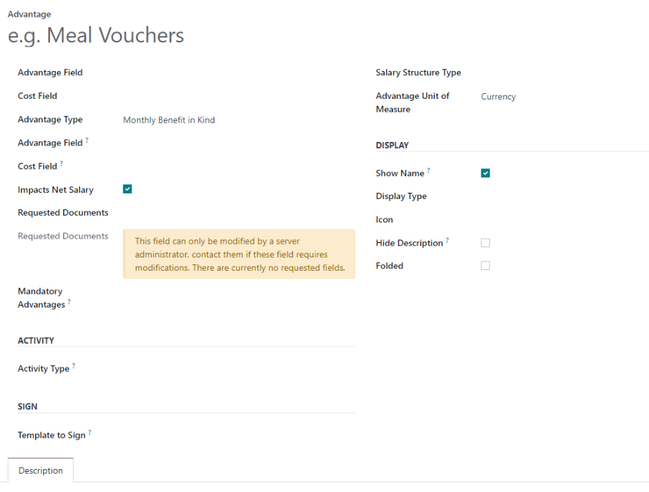
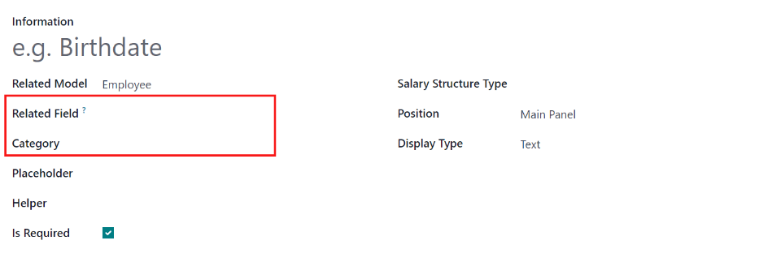

=======
Payroll
=======

Odoo *Payroll* is used to process work entries and create payslips for employees, including both
regular pay and commission. Payroll works in conjunction with other Odoo apps, such as *Employees*,
*Timesheets*, *Time Off*, and *Attendances*.

The *Payroll* app helps ensure there are no issues or conflicts when validating work entries,
handles country-specific localizations to ensure that payslips follow local rules and taxes, and
allows for salary assignments. Payroll configuration is critical to ensure accurate and timely
processing of payslips.

Settings
========

To access the *Settings*, go to :menuselection:`Payroll --> Configuration --> Settings`. Whether or
not payslips are posted in accounting, and whether SEPA payments are created, is selected here.

The :guilabel:`Settings` screen is where localization settings are configured. *Localizations* are
country-specific settings pre-configured in Odoo at the creation of the database, and account for
all taxes, fees, and allowances for that particular country. The :guilabel:`Localization` section of
the :guilabel:`Settings` includes a detailed view of all benefits provided to employees.

.. image:: payroll/payroll-settings.png
   :align: center
   :alt: Settings available for Payroll.

Any country-specific localizations are set up in the :guilabel:`Localization` section of the
:guilabel:`Settings` screen. All localization items are pre-populated when the country is specified
during the creation of the database. It is not recommended to alter the localization settings unless
specifically required.

Work entries
============

A *work entry* is an individual record on an employee's timesheet. Work entries can be configured to
account for all types of work and time off, such as :guilabel:`Attendance`, :guilabel:`Sick Time
Off`, :guilabel:`Training`, or :guilabel:`Public Holiday`.

Work entry types
----------------

When creating a work entry in the *Payroll* application, or when an employee enters information in
the *Timesheets* application, a :guilabel:`Work Entry Type` needs to be selected. The list of
:guilabel:`Work Entry Types` is automatically created based on localization settings set in the
database.

To view the current work entry types available, go to :menuselection:`Payroll --> Configuration -->
Work Entry Types`.

Each work entry type has a code to aid in the creation of payslips, and ensure all taxes and fees
are correctly entered.

.. image:: payroll/work-entry-types.png
   :align: center
   :alt: List of all work entry types currently available.

New work entry type
~~~~~~~~~~~~~~~~~~~

To create a new :guilabel:`Work Entry Type`, click the :guilabel:`New` button, and enter the
information on the form:

- :guilabel:`Work Entry Type Name`: The name should be short and descriptive, such as `Sick Time` or
  `Public Holiday`.
- :guilabel:`Payroll Code`: This code appears with the work entry type on timesheets and payslips.
  Since the code is used in conjunction with the *Accounting* application, it is advised to check
  with the accounting department for a code to use.
- :guilabel:`DMFA code`: This code is used to identify DMFA entries on a corresponding DMFA report,
  and is for Belgian-based companies only.
- :guilabel:`External Code`: This code is used for exporting data to a third-party payroll service.
  Refer to the third-party being used in order to determine the code to enter for the specific work
  type entry.
- :guilabel:`SDWorx code`: This code is only for companies that use SDWorx, a payroll service
  provider.
- :guilabel:`Color`: Select a color for the particular work entry type.
- :guilabel:`Rounding`: The rounding method determines how timesheet entries are displayed on the
  payslip.

  - :guilabel:`No Rounding`: A timesheet entry is not modified.
  - :guilabel:`Half Day`: A timesheet entry is rounded to the closest half day amount.
  - :guilabel:`Day`: A timesheet entry is rounded to the closest full day amount.

.. example::
   If the working time is set to an 8-hour work day (40-hour work week), and an employee enters a
   time of 5.5 hours on a timesheet, and :guilabel:`Rounding` is set to :guilabel:`No Rounding`, the
   entry remains 5.5 hours. If :guilabel:`Rounding` is set to :guilabel:`Half Day`, the entry is
   changed to 4 hours. If it is set to :guilabel:`Day`, it is changed to 8 hours.

- :guilabel:`Unpaid in Structures Types`: If the work entry is for unpaid work, specify which pay
  structure the work entry applies to from the drop-down menu.
- Check boxes: If any of the items in the list applies to the work entry, check off the box by
  clicking it. If :guilabel:`Time Off` is checked off, a :guilabel:`Time Off Type` field appears.
  This field has a drop-down menu to select the specific type of time off, or a new type of time off
  can be entered. :guilabel:`Keep Time Off Right` is for Belgian-specific companies, and will not
  appear for other localizations. This option determines if the time off should affect the time off
  benefits for the following year.

Working schedules
-----------------

To view the currently configured working schedules, go to :menuselection:`Payroll --> Configuration
--> Working Schedules`. The working schedules that are available for an employee's contracts and
work entries are found in this list.

Working schedules are company-specific. Each company must identify each type of working schedule
they use. For example, an Odoo database containing multiple companies that use a standard 40-hour
work week needs to have a separate working schedule entry for each company that uses the 40-hour
standard work week.

.. image:: payroll/working-schedules.png
   :align: center
   :alt: All working schedules currently set up in the database.

New working schedule
~~~~~~~~~~~~~~~~~~~~

To create a new working schedule, click the :guilabel:`New` button, and enter the information on the
form.

The fields are auto-populated for a regular 40-hour work week but can be modified. First, change the
name of the working time by modifying the text in the :guilabel:`Name` field. Next, make any
adjustments to the days and times that apply to the new working time.

In the :guilabel:`Working Hours` tab, modify the :guilabel:`Day of Week`, :guilabel:`Day Period`,
and :guilabel:`Work Entry Type` selections by clicking on the drop-down menus in each column and
making the desired selection. The :guilabel:`Work From` and :guilabel:`Work To` columns are modified
by typing in the time.

.. note::
   The :guilabel:`Work From` and :guilabel:`Work To` times must be in a 24-hour format. For example,
   `2:00 PM` would be entered as `14:00`.

If the working time should be in a two-week configuration, click the :guilabel:`Switch to 2 weeks
calendar` button in the top left. This creates entries for an :guilabel:`Even week` and an
:guilabel:`Odd week`.

.. image:: payroll/new-working-schedule.png
   :align: center
   :alt: New working schedule form.

Salary
======

.. _payroll/structure-types:

Structure types
---------------

In Odoo, an employee's payslip is based on *structures* and *structure types*, which both affect how
an employee enters timesheets. Each structure type is an individual set of rules for processing a
timesheet entry, which consists of different structures nested within it. Structure types define how
often an employee gets paid, the working hours, and if wages are based on a salary (fixed) or how
many hours the employee worked (varied).

For example, a structure type could be `Employee`, and that structure type could have two different
structures in it: a `Regular Pay` structure which includes all the separate rules for processing
regular pay, as well as a structure for an `End of Year Bonus` which includes the rules only for the
end of year bonus. Both the `Regular Pay` structure and `End of Year Bonus` structure are structures
within the `Employee` structure type.

The different structure types can be seen by going to :menuselection:`Payroll --> Configuration -->
Structure Types`.

There are two default structure types configured in Odoo: *Employee* and *Worker*. Typically,
*Employee* is used for salaried employees, which is why the wage type is *Monthly Fixed Wage*, and
*Worker* is typically used for employees paid by the hour, so the wage type is *Hourly Wage*.

.. image:: payroll/structure-type.png
   :align: center
   :alt: List of all structure types.

Click the :guilabel:`New` button to make a new structure type. Most fields are pre-populated, but
all fields can be edited.

Structures
----------

*Salary structures* are the different ways an employee gets paid within a specific *structure*, and
are specifically defined by various rules.

The amount of structures a company needs for each structure type depends on how many different ways
employees are paid, and how their pay is calculated. For example, a common structure that could be
useful to add may be a `Bonus`.

To view all the various structures for each structure type, go to :menuselection:`Payroll -->
Configuration --> Structures`.

Each :ref:`structure type <payroll/structure-types>` lists the various structures associated with
it. Each structure contains a set of rules that define it.

.. image:: payroll/salary-structure.png
   :align: center
   :alt: All available salary structures.

Click on a structure to view its :guilabel:`Salary Rules`. These rules are what calculate the
payslip for the employee.

.. image:: payroll/structure-regular-pay-rules.png
   :align: center
   :alt: Salary structure details for Regular Pay.

Rules
-----

Each structure has a set of *salary rules* to follow for accounting purposes. These rules are
configured by the localization, and affect the *Accounting* application, so modifications to the
default rules, or the creation of new rules, should only be done when necessary.

To view all the rules, go to :menuselection:`Payroll app --> Configuration --> Rules`. Click on a
structure (such as :guilabel:`Regular Pay`) to view all the rules.

To make a new rule, click :guilabel:`New`. A new rule form appears. Enter the information in the
fields.

The required fields for a rule are:

- :guilabel:`Name`: Enter a name for the rule.
- :guilabel:`Category`: Select a category the rule applies to from the drop-down menu, or enter a
  new one.
- :guilabel:`Code`: Enter a code to be used for this new rule. It is recommended to coordinate with
  the accounting department for a code as this will affect them.
- :guilabel:`Salary Structure`: Select a salary structure the rule applies to from the drop-down
  menu, or enter a new one.
- :guilabel:`Condition Based on`: In the :guilabel:`General` tab, select from the drop-down menu
  whether the rule is :guilabel:`Always True` (always applies), a :guilabel:`Range` (applies to a
  specific range, which is entered beneath the selection), or a :guilabel:`Python Expression` (the
  code is entered beneath the selection).
- :guilabel:`Amount Type`: In the :guilabel:`General` tab, select from the drop-down menu whether
  the amount is a :guilabel:`Fixed Amount`, a :guilabel:`Percentage (%)`, or a :guilabel:`Python
  Code`. Depending on what is selected, the fixed amount, percentage, or Python code needs to be
  entered next.

Rule parameters
---------------

.. note::
   Currently, the :guilabel:`Rule Parameters` feature found inside the :menuselection:`Payroll app
   --> Configuration` menu is still in development and only serves a specific use case for Belgian
   markets. The documentation will be updated when this section has matured to more markets.

Other input types
-----------------

When creating payslips, it is sometimes necessary to add other entries for specific circumstances,
like expenses, reimbursements, or deductions. These other inputs can be configured by going to
:menuselection:`Payroll --> Configuration --> Other Input Types`.

.. image:: payroll/other-input.png
   :align: center
   :alt: Other input types for payroll.

To create a new input type, click the :guilabel:`New` button. Enter the :guilabel:`Description`, the
:guilabel:`Code`, and which structure it applies to in the :guilabel:`Availability in Structure`
field.

.. image:: payroll/input-type-new.png
   :align: center
   :alt: Create a new Input Type.

Salary package configurator
===========================

The various options under the :guilabel:`Salary Package Configurator` section of the
:menuselection:`Payroll --> Configuration` menu all affect an employee's potential salary. These
sections (:guilabel:`Advantages`, :guilabel:`Personal Info`, :guilabel:`Resume`, and
:guilabel:`Offers`) specify what benefits can be offered to an employee in their salary package.

Depending on what information an employee enters (such as deductions, dependents, etc.), their
salary is adjusted accordingly. When an applicant applies for a job on the company website, the
sections under :guilabel:`Salary Package Configurator` directly affect what the applicant sees, and
what is populated as the applicant enters information.

Advantages
----------

When offering potential employees a position, there can be certain *advantages* set in Odoo in
addition to the salary to make the offer more appealing (such as extra time off, access to a company
car, reimbursement for a phone or internet, etc.).

To see the advantages, go to :menuselection:`Payroll --> Configuration --> Advantages`. Advantages
are grouped by :guilabel:`Structure type`.

.. image:: payroll/advantages.png
   :align: center
   :alt: Settings available for payroll.

To make a new advantage, click the :guilabel:`New` button, and enter the information in the fields.

The required fields for an advantage are:

- :guilabel:`Name`: Enter the name for the advantage.
- :guilabel:`Advantage Field`: Select from the drop-down menu what field in the payslip this
  advantage appears under.
- :guilabel:`Advantage Type`: Select from the drop-down menu what type of advantage the benefit is.
  Select from :guilabel:`Monthly Benefit in Kind`, :guilabel:`Monthly Advantages in Net`,
  :guilabel:`Monthly Advantages in Cash`, or :guilabel:`Yearly Advantages in Cash`.
- :guilabel:`Salary Structure Type`: Select from the drop-down menu which salary structure type this
  advantage applies to.
- :guilabel:`Display Type`: Select from the drop-down menu how this advantage is displayed.

Personal info
-------------

Every employee in Odoo has an *employee card* which is created when a candidate becomes an
employee. This card includes all of their personal information, resume, work information, and
documents.

The personal information is gathered from the salary package configurator section that a
candidate fills out after being offered a position. This personal information is then transferred to
the employee card when they are hired.

To view an employee's card, go to the main :menuselection:`Employees` app dashboard, and click on
the employee's card.

.. note::
   An employee card can be thought of as an employee personnel file.

The *Personal Information* section lists all of the fields that are available to enter on the
employee's card. To access this section, go to :menuselection:`Payroll --> Configuration -->
Personal Info`.

.. image:: payroll/personal-info.png
   :align: center
   :alt: Personal information that appear on employee cards to enter.

To edit an entry, select it from the list, and modify the entry. To make a new entry, click the
:guilabel:`New` button.

The required fields, aside from entering the :guilabel:`Information` name, are
:guilabel:`Related Field` and :guilabel:`Category`. Select a :guilabel:`Related Field` from the
drop-down menu that best describes what kind of information this entry is, and where it is going to
be stored in the backed. Select a :guilabel:`Category` from the drop-down menu that the information
should be under, such as :guilabel:`Address` or :guilabel:`Personal Documents`.

The two most important fields on the personal info form are :guilabel:`Is Required` and
:guilabel:`Display Type`. Checking the :guilabel:`Is Required` box makes the field mandatory on the
employee's card. The :guilabel:`Display Type` drop-down menu allows for the information to be
entered in a variety of ways, from a :guilabel:`Text` box, to a customizable :guilabel:`Radio`
button, a :guilabel:`Checkbox`, a :guilabel:`Document`, and more.

Resume
------

.. note::
   Currently, the :guilabel:`Resume` feature found inside the :menuselection:`Payroll app -->
   Configuration` menu is still in development and only serves a specific use case for Belgian
   markets. The documentation will be updated when this section has matured to more markets.

Offers
------

When a candidate is offered a position, there are several items that need to be tracked in order
for a business to stay organized, such as where in the offer process the candidate is, how long the
offer is valid for, as well as all the offer details. These details are all stored in each *offers*
record.

To view all offers, go to :menuselection:`Payroll --> Configuration --> Offers`. All offers that
have been sent to either potential candidates or current employees will appear in this list. The
status, offer start date and expiration date, amount of the contract, and more, can all be found in
this list. Offers sent via the :guilabel:`Recruitment` application appear here, but there is an
option to create a new offer from the :guilabel:`Payroll` application as well.

.. image:: payroll/offers.png
   :align: center
   :alt: New offer for an employee or candidate.

To create a new offer, click the :guilabel:`New` button. The two required fields are the
:guilabel:`Contract Template`, and the :guilabel:`Company`. Select the :guilabel:`Contract Template`
and :guilabel:`Company` from the drop-down menus. Fill in any other details for the offer, such as
the :guilabel:`Job Title`, :guilabel:`Department`, the :guilabel:`Contract Start Date` and the
:guilabel:`Offer Validity Date`.
